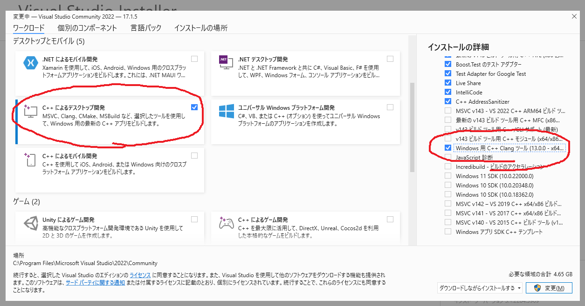

Presentation of the OS: The paxos_8

The paxos_8 is the latest version of the os, it brings a very reliable event system allowing a very fluid use of the device. Its new graphic module adds new, more aesthetic widgets in a precise theme designed on figma!

The homepage features 8 simplistic apps but none too many:

The phone application for making calls

Message, to send bubble messages to contacts

Contacts, which allows you to add and delete contacts that can be used in other applications

Calculator

Clock, which will allow you to program alarms and launch stopwatches and timers

Map to calculate its GPS coordinates

and two games which are snake and the 2048!

see more on https://www.paxo.fr

### Windows Build Instructions

Before getting started, you need an IDE, a Visual Studio License (Community Edition is enough) and know how to setup a CMake project with custom toolchain.

1. Install Visual Studio Community or Visual Studio Build Tools with CLang

2. Setup your favorite IDE (eg. CLion) with CLang (very important ! not compatible with MSVC or MinGW)

3. Setup CMake using Ninja (recommended)

4. You shouldn't have to install any library (everything is included)