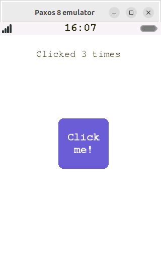

# The Lua programming language for PaxOS
## Application in Lua
We use lua to produce applications compatible with PaxOS.
Applications require the following layout:

 - app/
	 - 	**main.lua**
	 - conf.txt
	 - logo.png (42x42)

Each application requires a '**run**' function in order to be executed:

```lua
function run()
    print("Hello world!")
end
```

Here's a simple example program to show you what an application looks like.

```lua
p = require('paxolib')

function run()
	local window  = p.window("My Application")
	local button  = p.button(window, 100, 150, 100, 100)
	local label   = p.label(window, 50, 10, 200, 100)
	local counter = 0
	
	p.setWindow(window)
	button:setText("Click me!")
	button:onClick(function ()
			counter = counter + 1
			label:setText("Clicked " .. tostring(counter) .. " times")
		end)
end
```
This is what we get:



## Documentation
The following documentation summarizes the functions currently available. Currently, we have three gui components in the form of userdata.
```lua
window = paxlib.window("Title")
box    = paxlib.box(window, x, y, width, height)
label  = paxlib.label(window, x, y, width, height)
button = paxlib.button(window, x, y, width, height)
```
Each of these functions has a table that can be accessed via an OOP style. They all contain more or less the same methods, such as the following:

```lua
gui:setX(0)
gui:setY(0)
gui:getX()
gui:getY()
gui:setWidth(0)
gui:setHeight(0)
gui:getWidth()
gui:getHeight()
gui:setText("Hello World!")
gui:onClick(function () print("Hello World!") end)
gui:setColor(paxlib.COLOR_SUCCESS)
```
Colors are currently represented as integers and are likely to change in the future and become userdata.
The following colors are available:
  - COLOR_LIGHT
  - COLOR_BLACK
  - COLOR_PRIMARY
  - COLOR_SUCCESS
  - COLOR_WHITE

Finally, we are also able to read and write files in the directory allocated to the application.
```lua
path   = "conf.txt"
string = paxlib.readFile(path)
paxlib.writeFile(path, "[" .. string .. "]")
```
Note: the path is relative to the app folder